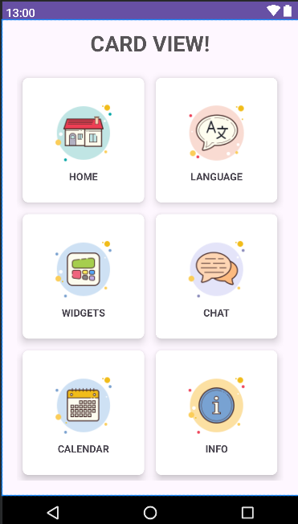

<!-- <h1><a href"">Example Project Card V</a></h1> -->

## 📙 Sobre
 
 **Projeto CardView**, Botando em prática os conhecimentos obtidos, realizando CardViews no novo App de Hotelaria (em desenvolvimento) da @FluxTecnologia. 

## 🛠️ Ferramentas

- Kotlin

## ♻️Contribuir 

```bash
# Clonar repositório
# Abra seu terminal e digite:

git clone https://github.com/geisonbruno1/CardView-Design
```

```bash
# Instale as dependências:

No build.gradle: 
implementation("androidx.cardview:cardview:1.0.0")
```


 
